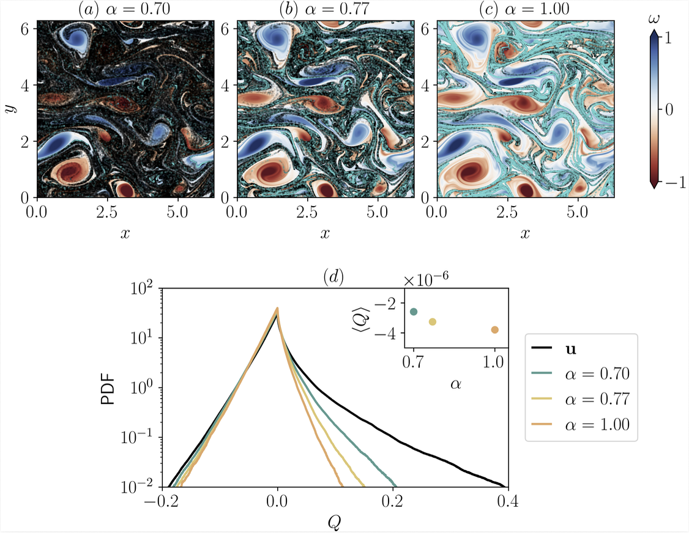

# Codes to run inertial particles in 2D turbulence
--- 
**Uses pseudo-spectral codes and 6th order [b-spline interpolation](https://epubs.siam.org/doi/epdf/10.1137/110849018) with RK4 time stepping**

**Requires CUPY to run** 

Caustics are found by evolving gradient equation.

RUN the bare code till it reaches stationary state ~t = 1000 in simulation units and then seed the particles. 

For deatils of the study, see [ArXiV:2601.14179](https://arxiv.org/pdf/2601.14179).

